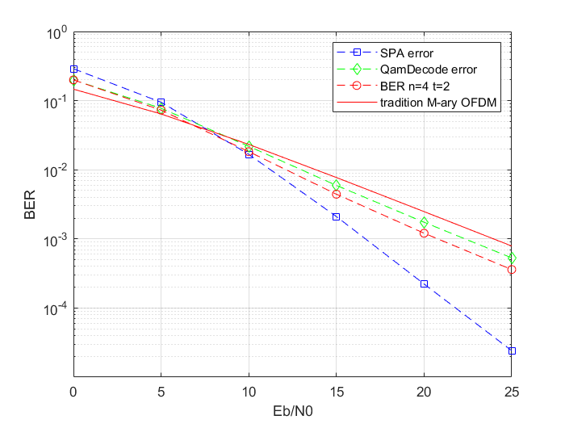

# OFDM-IM
OFDM with Index Modulation (OFDM-IM) using LLR detection

result Picture ： 

Reference:[1] Başar E, Aygölü Ü, Panayırcı E, et al. Orthogonal frequency division multiplexing with index modulation[J]. IEEE Transactions on signal processing, 2013, 61(22): 5536-5549.

